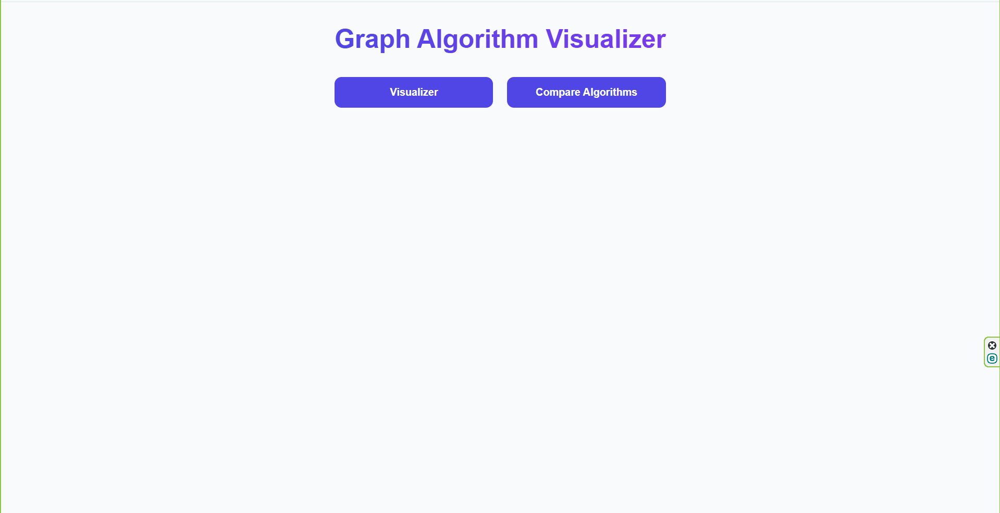
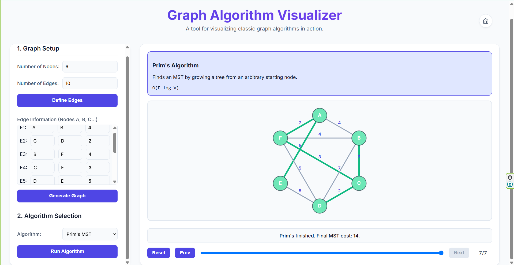
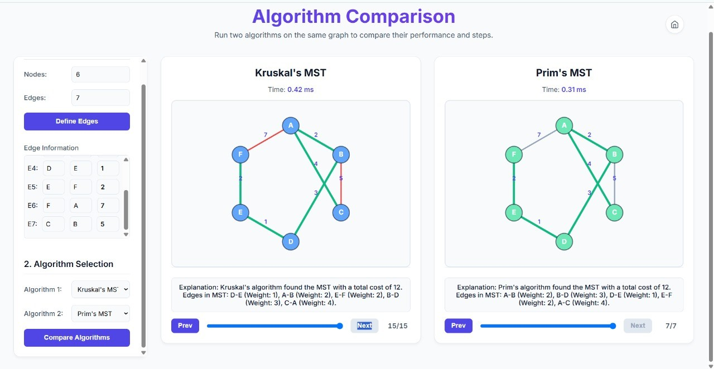

# Mini-Project-1A
The Graph Algorithm Visualizer is an interactive web-based tool built using Python, HTML, CSS, and JavaScript that provides dynamic step-by-step visual simulations of graph algorithms, helping learners clearly understand how nodes are processed, distances are updated, and optimal paths are formed.
 

<h3> Features </h3>
- Interactive graph creation with custom nodes, edges, and weights  
- Step-by-step visualization of four algorithms: Dijkstra, Bellman-Ford, Prim, and Kruskal  
- Side-by-side algorithm comparison with execution time and performance metrics 
- Playback controls (play, pause, next step, reset) for detailed learning 
- Real-time visualization using color-coding for nodes, edges, and algorithm states 
- Supports weighted graphs and negative edges (Bellman-Ford) 
- Displays final MST/shortest path along with total cost and steps taken 

<h3> Tech Stack </h3>

- **Frontend:** HTML, CSS, JavaScript 
- **Backend:** Python, Flask 

<h3> Installations </h3>

<h4>1. Clone the Repository </h4>
<pre><code> git clone https://github.com/Susheyyy/Mini-Project-1A.git
cd Mini-Project-1A </code></pre>

<h4> 2. Create a python environment (recommended) </h4>
<pre><code> python -m venv venv </code></pre>

Activate the environment
- Windows
<pre><code> venv\Scripts\activate </code></pre>

- macOS / Linux 
<pre><code> source venv/bin/activate </code></pre>

<h4>3. Install Dependencies </h4>
<pre><code> pip install -r requirements.txt </code></pre>

<h4>3. Install Dependencies </h4>
<pre><code>python app.py</code></pre>

<h3>How to Use</h3>

#### Single Algorithm Visualizer
1. Enter the number of nodes, edges, and their weights.
2. Select an algorithm (Dijkstra, Bellman-Ford, Prim, or Kruskal).
3. Click **Visualize** to see the step-by-step execution.
4. Use **Play**, **Pause**, **Next**, and **Reset** to control the animation.
5. View the final path/MST, total cost, and number of steps.

#### Algorithm Comparison
1. Open the **Comparison** page.
2. Select any two algorithms.
3. Enter your graph details once.
4. Click **Compare** to run both visualizations side-by-side.
5. Compare execution time, cost, and traversal behavior.

### Try a new graph
At any time, you can:
- Clear the graph  
- Change inputs  
- Run a different algorithm  
- Switch to comparison mode  

<h3> Screenshots </h3>

